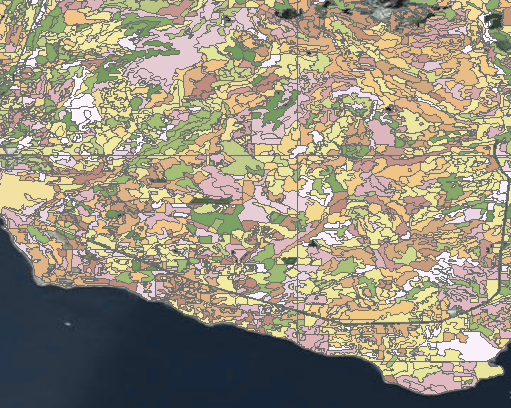
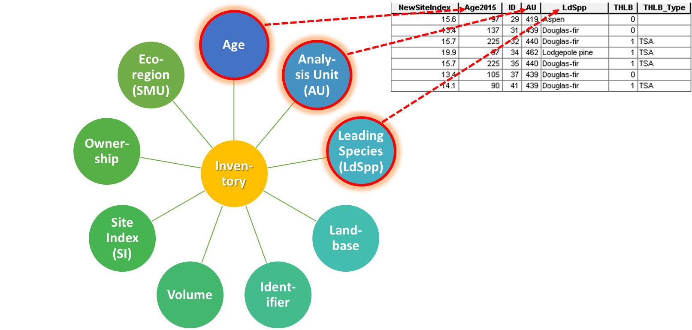
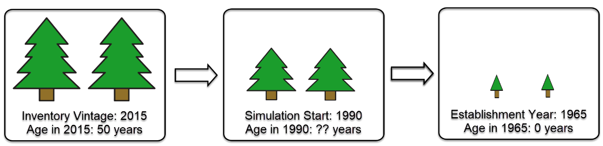
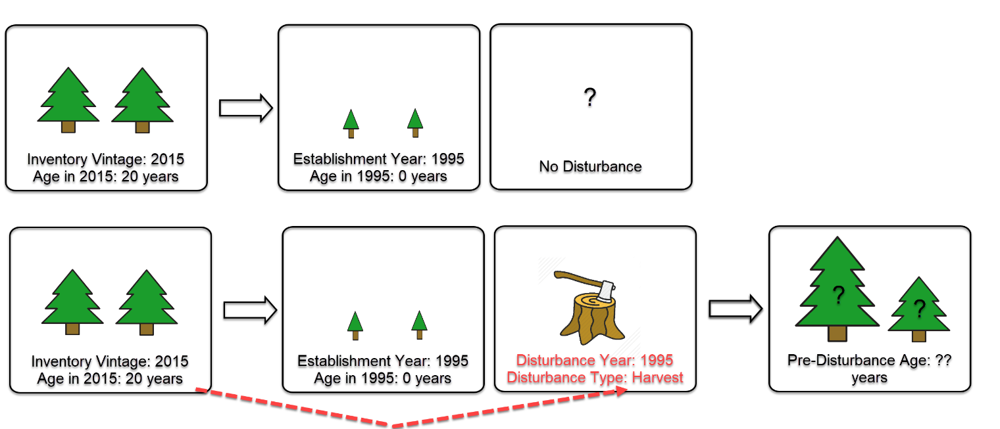

Data Preparation
================

The goal of input data preparation is to prepare a consistent and
error-free set of data that can be passed to GCBM/FLINT. Two support
tools existing to help prepare the spatial data layers and the input
database called the “Tiler” and “Recliner2GCBM” respectively. These
tools are described at the end of this section.

While the Tiler and Recliner2GCBM tools are extremely flexible and
helpful, it is nonetheless recommended that additional data preparation,
or “preprocessing” be carried out prior to passing data into them. The
Tiler and Recliner2GCBM do not create or edit data for the user; their
purpose is to read and organize data for use in GCBM/FLINT. The user
must use their own manual steps of scripts to ensure that data are
error-free and consistent, that data is created or adjusted where
necessary, and that links to aspatial data are present and clear.

The initial subsections that follow describe some of the typical and
important types of input data that GCBM requires, and the types of data
preprocessing that may be required. The final sections provide a brief
description of the roles of Tiler and Recliner2GCBM.

Forest attributes
-----------------

For spatially explicit forest carbon models, we must understand, pixel
by pixel, the attributes of the forest. We require this information to
model carbon dynamics such as growth and other annual processes such as
decay and turnover.

The basic forest attributes that we require are:

1. Tree type (e.g. species, genus, soft/hardwood)
2. Age

Additional attributes that are required to provide better accuracy to
carbon dynamics:

3. Tree species
4. Site index (or some measure of productivity, e.g. analysis unit)

Supplementary attributes that further refine stand dynamics:

6. Ecoregion
7. Biogeoclimatic Ecosystem Classification
8. Mean annual temperature
9. Forest management unit

For attributes such as tree type and age, we need to understand these
attributes at a stand level. So the attributes must be attached to a
polygon, or possibly a cluster of raster cells.

The additional and supplementary attributes may or may not be wrapped
together with the stand level information. In many cases, information
such as ecoregion and forest management units exist as broad, low detail
polygons across large areas.

Jurisdictions (provinces, countries, etc.) and private companies
typically maintain a “forest inventory” that contains detailed
information about tree type and age. Due to the complexity of the
information and large geographic area, these inventories can be very
large (multiple gigabytes) and contain hundreds of thousands, or even
millions of records.

When the data is stored in a shapefile or feature class format, each
forest stand polygon can be easily mapped to a long list of attributes.
GCBM does not necessarily require all of these attributes; it requires
those attributes that provide a link from the stand to a growth curve.
The required attributes for linking a stand polygon or pixel to a growth
curve are called attributes.

Through the use of manual and/or scripted steps, the user will need to
identify and complete the following with their forest inventories:

1. Identify a list of values from each classifier category and ensure
   that there is an exact syntax match to the growth curve classifier
   values. For example, “Douglas-fir” may not match “Douglas fir”.
   Correct where/if required.

   -  Python libraries such as GeoPandas are useful for accessing and
      querying the attribute tables of spatial data.

2. Assess the size and complexity of the forest inventory and the future
   processing requirements. If future processing with the forest
   inventory is required, it may be advantageous to grid the required
   inventory attributes into a raster format, to take advantage of
   threaded/blocked/multiprocessing techniques.

   -  Attributes such as Stand ID, Age, Species, etc. can be “pre-tiled”
      using the tiler, or rasterized with various other geoprocessing
      tools such as GDAL.

3. Evaluate the inventory vintage (the year it was produced), the
   desired start date of the model simulation, and the age range. A
   “rollback” procedure may be required to adjust the age of the forest
   stand for the simulation start.
4. Where possible, it is recommended that the user reduce the polygon
   complexity (i.e. a number of vertices and/or features) and delete
   unnecessarily attributes. This can help ensure that errors associated
   with CPU/RAM resources do not occur, which are typically hard to
   identify that is even happening.

Disturbance Events
------------------

Disturbance events are mapped to pixels by overlaying spatially and
temporally described events. Typical disturbance events are harvest,
fire and insect, and may range from fully stand-replacing, to those that
cause only partial mortality, or defoliation. Events may be described in
separate shapefiles or feature classes, or they may be “baked-in” with
forest inventory information in the case of silvicultural treatments
such as thinning.

A significant challenge with disturbance event information is that it
may exist from several sources, with different affected areas and time
spans. To avoid confusion and model failure in GCBM/FLINT, the user
needs to manually, or through scripting, carrying out several
recommended steps.

1. Decide on a single source of data for each unique disturbance type,
   or combine multiple sources into a single data layer. GCBM can not
   have two disturbance events of the same type occur in the same year.
2. Carefully map the source of disturbance events of type to the time
   spans that they correspond to. Switching between data sources for a
   given disturbance type assumes that each source is methodologically
   consistent.
3. Clean out overlaps within the same disturbance type and year. Correct
   geometry errors.
4. If the data is large and complex, and will be required for inventory
   age adjustment processes (i.e., rollback) then consider gridding the
   data into a raster format.
5. Identify a list of all disturbance types that will be used, and
   ensure that there is a corresponding match in the Archive Index
   Database.

It is important that the user becomes familiar with the spatial
disturbance event information to identify and correct for errors. With
that in mind, it can be advantageous to use the ArcPy toolset from
ArcGIS, or various other GDAL tools combined with open source GIS tools,
to interactively inspect and build data preparation scripts.

Rollback, Simulation Start Age
------------------------------

Frequently, the vintage of the forest inventory that we work with will
not correspond to the simulation start year. When we move the age of the
forest stand, as reported in the inventory, back to the start of the
simulation, we may encounter a situation where the age reaches zero.
This means that a stand-replacing a disturbance event, such as harvest
or fire, must have occurred to reset the age of the stand. The figures
below provide some example rollback situations.

There are a wide variety of additional rollback situations that can
occur. The purpose of mentioning it here is to highlight that a process
is required to harmonize inventory age information and disturbance event
information, so that there is a sensible sequence of events and
parameters passed to GCBM.

The process typically involves stacking up various input data such as
inventories of various vintages, different disturbance events, and then
decided on a set of rules to resolve conflicts. When data is large and
complex, stacking and conflict resolution is easiest to handle when the
inputs are simple raster arrays. In array format, they can be handled
with database tools and powerful Python NumPy libraries.

For simple and small projects, rollback procedures are feasible within a
GIS package and with basic GDAL tools.

The end goal of a rollback process is the following:

1. An age layer at the start of the simulation that makes sense.
2. Disturbance layers that have been adjusted to match the inventory,
   OR, an inventory that has been adjusted to match the disturbance
   information.
3. If required, transition rules to help resolve disturbance/inventory
   discrepancies.

Future Events
-------------

Since GCBM/FLINT requires spatially described events or map data, future
event projections must be projected onto the forest landscape. Various
Python/GDAL/ArcGIS tools can be used to accomplish this, and the
procedures can range from placing events with simple “birdshot” style
blasts, to careful placement based on analysis of various spatial
supporting layers. To date, CFS has developed various versions of tools
that project future harvest and future wildfire events. Some consist of
open-source Python libraries and GDAL tools, while others make use of
ArcGIS tools or paid optimization packages. Generic future projection
tools have not yet been developed.

Disturbance Types and Matrices (Archive Index Database)
-------------------------------------------------------

Many projects have unique sets of disturbance events and matrices that
guide the transfer of carbon between pools for those events. The
disturbance event information from the input data, the tiler and the
Archive Index Database (AIDB) must co-exist and match.

The AIDB is a collection of model parameters, such as volume to biomass
parameters and disturbance matrices maintained by the CFS. The
information in this database is ultimately fed into Recliner2GCBM and
processed into a format ready for GCBM.

The user can add information to the AIDB such as new disturbance event
names and corresponding disturbance matrices, but they must ensure that
all values are field mappings are correct. Python tools that pass
information between spreadsheets and databases, such as the SQLite and
PyODBC libraries, are helpful to read and updated information in the
AIDB.

Growth and Yield
----------------

Description of forest growth (yield) is a critical component to
GCBM/FLINT models. The input typically consists of a table with a set of
growth curves. Each curve has a set of classifiers that can be linked to
a forest polygon. The yield is often described as a merchantable volume
increment in steps of 5 to 10 years.

+-------+-------+-------+-------+-------+-------+-------+-------+-------+-------+-------+-------+-------+
| Ana   | Sp    | Age   | Age   | Age   | Age   | Age   | Age   | Age   | Age   | Age   | Age   | Age   |
| lysis | ecies | (0)   | (10)  | (20)  | (30)  | (40)  | (50)  | (60)  | (70)  | (80)  | (90)  | (100) |
| Unit  |       |       |       |       |       |       |       |       |       |       |       |       |
| (SI)  |       |       |       |       |       |       |       |       |       |       |       |       |
+=======+=======+=======+=======+=======+=======+=======+=======+=======+=======+=======+=======+=======+
| 10    | Aspen | 0     | 0     | 1.2   | 5.9   | 15    | 27.9  | 45.6  | 66    | 89    | 112.1 | 134.4 |
+-------+-------+-------+-------+-------+-------+-------+-------+-------+-------+-------+-------+-------+
| 11    | B     | 0     | 0     | 0     | 0     | 0     | 0.6   | 2.3   | 5.8   | 11.3  | 19.2  | 29.2  |
|       | alsam |       |       |       |       |       |       |       |       |       |       |       |
|       | fir   |       |       |       |       |       |       |       |       |       |       |       |
+-------+-------+-------+-------+-------+-------+-------+-------+-------+-------+-------+-------+-------+
| 12    | Suba  | 0     | 0     | 0     | 0     | 0.2   | 24.3  | 62.7  | 112.4 | 165.4 | 219.1 | 269.6 |
|       | lpine |       |       |       |       |       |       |       |       |       |       |       |
|       | fir   |       |       |       |       |       |       |       |       |       |       |       |
+-------+-------+-------+-------+-------+-------+-------+-------+-------+-------+-------+-------+-------+
| 13    | He    | 0     | 0     | 0     | 0.1   | 0.5   | 1.2   | 2.5   | 3.9   | 5.6   | 8.1   | 25.9  |
|       | mlock |       |       |       |       |       |       |       |       |       |       |       |
+-------+-------+-------+-------+-------+-------+-------+-------+-------+-------+-------+-------+-------+
| 14    | Mou   | 0     | 0     | 0     | 0.1   | 0.5   | 1.2   | 2.5   | 3.9   | 5.6   | 8.1   | 25.9  |
|       | ntain |       |       |       |       |       |       |       |       |       |       |       |
|       | he    |       |       |       |       |       |       |       |       |       |       |       |
|       | mlock |       |       |       |       |       |       |       |       |       |       |       |
+-------+-------+-------+-------+-------+-------+-------+-------+-------+-------+-------+-------+-------+
| 50    | Whit  | 0     | 0     | 0     | 0     | 0     | 0     | 0     | 1.6   | 7.5   | 16.8  | 29.3  |
|       | ebark |       |       |       |       |       |       |       |       |       |       |       |
|       | pine  |       |       |       |       |       |       |       |       |       |       |       |
+-------+-------+-------+-------+-------+-------+-------+-------+-------+-------+-------+-------+-------+
| 51    | Lodg  | 0     | 0     | 0     | 0     | 0     | 0.2   | 0.7   | 2.1   | 7.5   | 15    | 24.9  |
|       | epole |       |       |       |       |       |       |       |       |       |       |       |
|       | pine  |       |       |       |       |       |       |       |       |       |       |       |
+-------+-------+-------+-------+-------+-------+-------+-------+-------+-------+-------+-------+-------+
| 52    | S     | 0     | 0     | 0     | 0     | 0     | 0     | 0.7   | 2.9   | 6.5   | 11.7  | 18.5  |
|       | pruce |       |       |       |       |       |       |       |       |       |       |       |
+-------+-------+-------+-------+-------+-------+-------+-------+-------+-------+-------+-------+-------+
| 53    | S     | 0     | 0     | 0     | 0     | 21.7  | 65.9  | 124   | 183.2 | 238.5 | 288   | 331.6 |
|       | pruce |       |       |       |       |       |       |       |       |       |       |       |
+-------+-------+-------+-------+-------+-------+-------+-------+-------+-------+-------+-------+-------+
| 54    | P     | 0     | 0     | 0     | 1.2   | 4.7   | 16.8  | 28.5  | 46.1  | 62.8  | 78.5  | 93.9  |
|       | oplar |       |       |       |       |       |       |       |       |       |       |       |
+-------+-------+-------+-------+-------+-------+-------+-------+-------+-------+-------+-------+-------+
| 70    | P     | 0     | 0     | 0.3   | 3     | 11.2  | 26.6  | 44.3  | 63.3  | 88.3  | 109.5 | 130.2 |
|       | oplar |       |       |       |       |       |       |       |       |       |       |       |
+-------+-------+-------+-------+-------+-------+-------+-------+-------+-------+-------+-------+-------+
| 71    | Cotto | 0     | 0     | 0     | 0.2   | 7     | 24.1  | 52.9  | 85.2  | 118.2 | 150   | 180   |
|       | nwood |       |       |       |       |       |       |       |       |       |       |       |
+-------+-------+-------+-------+-------+-------+-------+-------+-------+-------+-------+-------+-------+
| 72    | Aspen | 0     | 0     | 0     | 0.3   | 2.2   | 9.3   | 20.9  | 37.9  | 56    | 75.2  | 95.8  |
+-------+-------+-------+-------+-------+-------+-------+-------+-------+-------+-------+-------+-------+
| 73    | Aspen | 0     | 0     | 0.3   | 4.1   | 17.5  | 41.6  | 74.6  | 110.2 | 144.6 | 176.2 | 205.9 |
+-------+-------+-------+-------+-------+-------+-------+-------+-------+-------+-------+-------+-------+
| 74    | Paper | 0     | 0     | 0     | 0     | 5.5   | 20.7  | 44    | 69.3  | 92.9  | 113   | 130.3 |
|       | birch |       |       |       |       |       |       |       |       |       |       |       |
+-------+-------+-------+-------+-------+-------+-------+-------+-------+-------+-------+-------+-------+

Tiler
-----

The “Tiler” is a Python library that converts spatial data into a
consistent format that GCBM/FLINT can work with. Some of the key steps
that the tiler carries out are listed below.

1. Re-project data into a consistent projection and coordinate system.
   To ensure ease of use globally, a geographic coordinate system is
   used (i.e. latitude and longitude, no shape/length transformations.
2. Clip all data to a project “bounding box”.
3. Split data into consistent, pixel sizes; e.g. 0.001 degrees by 0.001
   degrees. Since a geographic coordinate system is used, the real-world
   size of each pixel may vary with latitude.
4. Anchor all data to a consistent reference point so that all pixels
   line up in perfect stacks.
5. Split data into spatial chunks to enable the use of
   threaded/block/multi processing tools.
6. Generate transition rules to be passed on to Recliner2GCBM.

Recliner2GCBM
-------------

The executable called Recliner2GCBM is responsible for preparing the
GCBM input database. It reads the Archive Index Database, yield curve
library, and transition rules from the tiler to create a single SQLite
databases with all aspatial parameters and that GCBM/FLINT will use.
