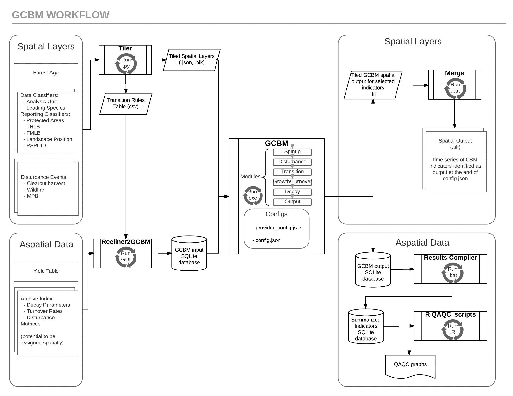

GCBM Data Objectives
====================

In order to successfully complete a GCBM/FLINT model simulation the
following two components are prerequisites, which are provided by the
scripts and tools associated with Recliner2GCBM (1) and the Tiler (2).

1. An input database that describes:

   -  Disturbance events
   -  Disturbance matrices
   -  Yield (growth) curves
   -  Volume to biomass conversion factors
   -  Decay/turnover equations and parameters
   -  Associations between forest type, management unit, ecoregion
   -  Transition rules
   -  Accounting rules, etc.

2. A set of “tiled” data.

   -  Tiled data is roughly equivalent a raster-format. It is a grid of
      data.
   -  A configuration JSON file describes what each grid data value
      corresponds to. For example, a value of 2 on the species grid may
      correspond to Douglas-fir.
   -  The JSON file may also describe transition rules or other
      post-event model behaviour such as a regeneration delay. These
      parameters are passed into the input database.

Each model simulation will typically have a unique set of tiled data;
but, may share an input database provided the parameters do not require
adjustment. Tiled inputs may be different depending on the model
“scenario”. For example, in one scenario, historic harvest events may
link to a disturbance type and matrix where utilization rates capture
85% of merchantable stem wood, while another scenario may link to a
disturbance type and matrix where 95% is captured.

In another example, future fire events in one scenario may cover twice
the area compared to a business-as-usual (BAU) scenario. In one final
example, harvest events may be followed up with residue burning in a BAU
scenario, or substituted for residue capture for bioenergy in a
comparative scenario.

The data that is directly input and output with GCBM/FLINT is described
in the example process diagram below.

Showcased above is the GCBM workflow. While the Tiler and Recliner2GCBM
set of tools and scripts ultimately provide those components, many data
preparation steps are required to first organize the data.
