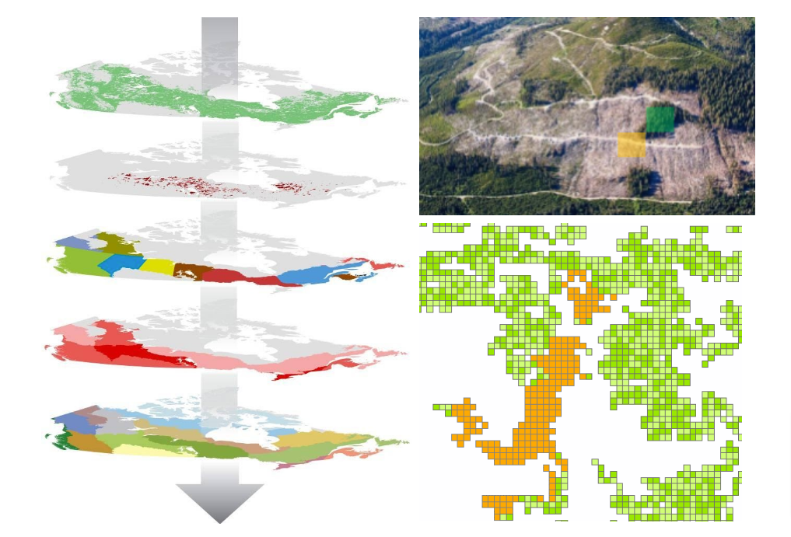

Input Data
==========

Spatially explicit modelling makes use of data that is spatially
described, which can also be thought of as maps of data. The reason for
this is so that model parameters can be broken into spatially discrete
chunks at whatever reference position, bounding area and resolution that
the user requires.

Spatial data is supported by aspatial data such as yield curves, volume
to biomass conversion factors and disturbance matrices that describe how
carbon should accumulate and transfer with regular annual processes as
well as unique disturbance events.

While spatially explicit modelling can provide the user with highly
flexible and spatially accurate results, it also requires that data is
very carefully prepared so that forest stands properties, disturbance
event sequences and growth behaviours are appropriately organized and
connected.

The following is a sample list of spatial and aspatial input data, each
with descriptions of the types of parameters that might be derived from
them. The next sections of this document describe data handling and
preparation recommendations to ensure that inputs are properly prepared
for use in GCBM/FLINT.

Forest inventory
^^^^^^^^^^^^^^^^

-  Stand polygon outline (position and geometry of forest stand
   properties)
-  Age
-  Leading species, or species composition
-  Site index, or silvicultural intensity (growth performance)
-  Silvicultural treatments such as thinning, prescribed burning or
   harvest
-  Harvest eligibility

Harvest history
^^^^^^^^^^^^^^^

-  Cutblock polygons.
-  Year of harvest.
-  Type of harvest (e.g. clearcut, selective, etc.)

Fire history
^^^^^^^^^^^^

-  Fire perimeter polygon.
-  Year of fire.
-  Fire severity if available.

Insect history
^^^^^^^^^^^^^^

-  Pest event polygon.
-  Year of occurrence.
-  Insect type (e.g. pine beetle, aspen defoliator).
-  Severity class (e.g low, medium, high).

Management unit boundaries
''''''''''''''''''''''''''

-  Boundary of management unit.
-  Name.
-  Unit code.

.. _biogeoclimatic-ecosystem-classification--ecoregion:

Biogeoclimatic Ecosystem Classification / Ecoregion
^^^^^^^^^^^^^^^^^^^^^^^^^^^^^^^^^^^^^^^^^^^^^^^^^^^

-  May define certain disturbance event behaviours, growth,
   decomposition parameters and biomass conversion coefficients.

Mean annual temperature
^^^^^^^^^^^^^^^^^^^^^^^

-  May influence growth and decomposition parameters.

Growth and yield curves (aspatial)
^^^^^^^^^^^^^^^^^^^^^^^^^^^^^^^^^^

-  Comprehensive table containing all possible combinations of species,
   site index, etc. that occur in the forest inventory to define the
   growth dynamics of each stand type.
-  Gross merchantable volume at specific and regular stand age
   increments.

Volume to biomass parameters
^^^^^^^^^^^^^^^^^^^^^^^^^^^^

-  Equations and/or factors that describe how to convert volume-based
   yield curves to carbon biomass.
