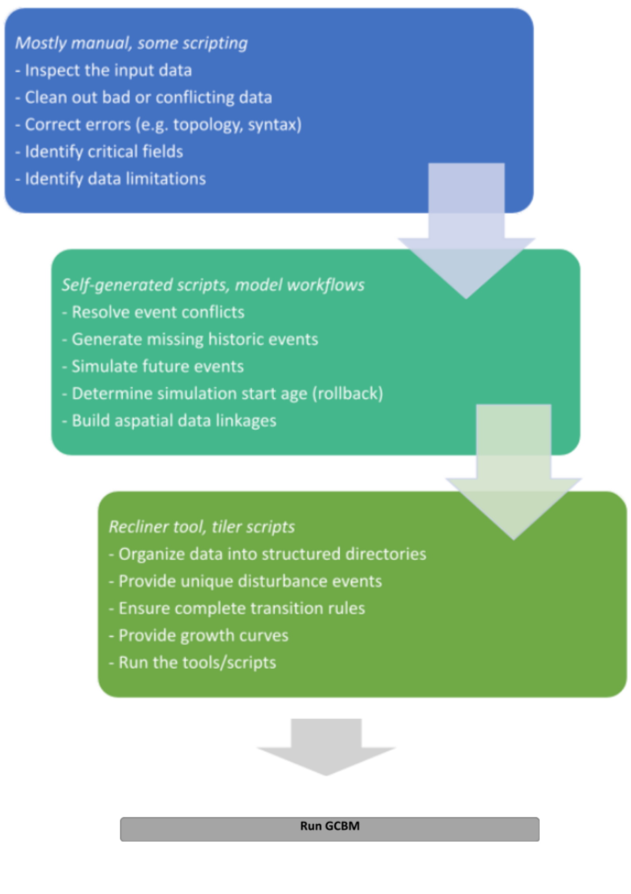

Summary
=======

The steps required to run a successful model simulation through
GCBM/FLINT are dependent on the features of the input data, and the
users modelling objectives. The workflow described in the flowchart
below is a high-level generalization.

